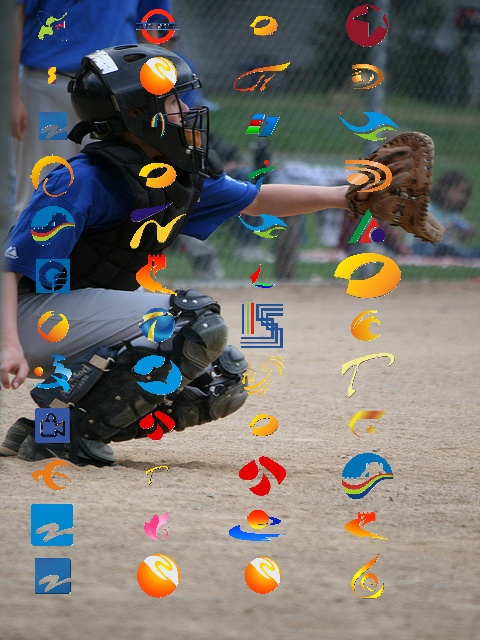

# 利用yolov5进行台标检测识别，将各个台标转化为目标识别，该方法只适用于有限个目标签名
1. 在有一些台标图像和一些背景图之后，可在项目[tvlogo_dataset](https://github.com/JiangHejun/tvlogo_dataset)中进行手写体数据集生成，手写体如：
<p align="center">
    
</p>

2. 在生成完成数据集之后，运行如：
```
python train.py --data xx/coco_sign.yaml --device 0
```

3. 训练完成之后，运行如：
```
python detect.py --source xx/test_sign --weights runs/train/exp/weight/best.pt --conf 0.25
```

4. 训练效果如下：
<p align="center">
    
</p>